# Warp 仓库完整依赖调用图

## 概览

Warp 终端 Rust monorepo: **1 个 app crate** (`app/`) + **64 个 library crate** (`crates/`)

---

## 分层架构总览

```
┌─────────────────────────────────────────────────────────────────────┐
│  APP LAYER: warp (app/)                                             │
│    8 binaries: warp-oss, warp, stable, dev, preview, integration    │
│    2130 .rs files across 60+ feature modules                        │
├─────────────────────────────────────────────────────────────────────┤
│  FEATURE LAYER                                                      │
│    ai, cloud_object_client, warp_server_client,                     │
│    cloud_object_models, lsp, mcp, remote_server, onboarding,        │
│    warp_completer, warp_files                                       │
├─────────────────────────────────────────────────────────────────────┤
│  CORE LAYER                                                         │
│    warp_core, warp_terminal, warp_editor, warp_graphql,             │
│    cloud_objects, settings, persistence, warp_server_auth,          │
│    http_client                                                      │
├─────────────────────────────────────────────────────────────────────┤
│  FOUNDATION LAYER                                                   │
│    warp_util, warpui_core, warpui_extras, warp_features,            │
│    settings_value, string-offset, sum_tree, command,                │
│    markdown_parser                                                  │
├─────────────────────────────────────────────────────────────────────┤
│  LEAF LAYER (zero internal dependencies)                            │
│    firebase, websocket, warp_graphql_schema, field_mask,            │
│    prevent_sleep, handlebars, natural_language_detection,            │
│    virtual_fs, channel_versions, local_control, mcp_types,          │
│    warp_web_event_bus, fuzzy_match, warp_features,                  │
│    settings_value_derive                                            │
└─────────────────────────────────────────────────────────────────────┘
```

---

## Mermaid 依赖图

```mermaid
graph TD
    subgraph "Leaf Layer (无内部依赖)"
        firebase
        websocket
        warp_graphql_schema
        field_mask
        prevent_sleep
        handlebars
        natural_language_detection
        virtual_fs
        channel_versions
        local_control
        mcp_types
        warp_web_event_bus
        warp_js
        command
        fuzzy_match
        sum_tree
        string_offset["string-offset"]
        markdown_parser
        settings_value_derive
        warp_features
    end

    subgraph "Foundation Layer"
        settings_value --> settings_value_derive
        warp_util --> command
        warpui_core --> warp_util
        warpui_core --> markdown_parser
        warpui_extras --> warpui_core
    end

    subgraph "Core Layer"
        settings --> settings_value
        settings --> warp_features
        settings --> warpui_core
        settings --> warpui_extras
        warp_core --> warp_util
        warp_core --> warp_features
        warp_core --> settings
        warp_core --> warpui_core
        warp_core --> warpui_extras
        warp_core --> websocket
        warp_core --> string_offset
        http_client --> warp_core
        http_client --> prevent_sleep
        warp_graphql --> warp_graphql_schema
        warp_graphql --> http_client
        warp_graphql --> websocket
        warp_graphql --> warp_core
        warp_graphql --> persistence
        persistence --> warp_multi_agent_api
        warp_server_auth --> warp_core
        warp_server_auth --> warp_graphql
        warp_server_auth --> warp_managed_secrets
        warp_server_auth --> warpui_core
        cloud_objects --> warp_core
        cloud_objects --> warp_graphql
        cloud_objects --> warp_server_auth
        cloud_objects --> settings_value
        cloud_objects --> warpui_core
        cloud_object_persistence --> cloud_objects
        cloud_object_persistence --> persistence
        warp_editor --> warpui_core
        warp_editor --> warp_core
        warp_editor --> warp_util
        warp_editor --> sum_tree
        warp_editor --> string_offset
        warp_editor --> markdown_parser
        warp_editor --> vim
        vim --> warp_core
        vim --> warpui_core
        vim --> string_offset
        warp_terminal --> warp_core
        warp_terminal --> warp_util
        warp_terminal --> warp_completer
        warp_terminal --> warpui_core
        warp_terminal --> channel_versions
    end

    subgraph "Feature Layer"
        warp_cli --> warp_core
        warp_cli --> warp_util
        warp_cli --> local_control
        warp_completer --> fuzzy_match
        warp_completer --> warp_cli
        warp_completer --> warp_core
        warp_completer --> warpui_core
        warp_completer --> warp_util
        warp_completer --> command
        input_classifier --> warp_completer
        input_classifier --> natural_language_detection
        repo_metadata --> warpui_core
        repo_metadata --> warp_core
        repo_metadata --> warp_util
        watcher --> warpui_core
        warp_files --> remote_server
        warp_files --> warp_core
        warp_files --> warp_util
        warp_files --> watcher
        warp_files --> repo_metadata
        remote_server --> warp_core
        remote_server --> warpui_core
        remote_server --> warp_util
        remote_server --> repo_metadata
        remote_server --> command
        lsp --> jsonrpc
        lsp --> node_runtime
        lsp --> warp_core
        lsp --> warp_util
        lsp --> warpui_core
        lsp --> repo_metadata
        lsp --> http_client
        jsonrpc --> warpui_core
        node_runtime --> warp_core
        node_runtime --> http_client
        node_runtime --> command
        mcp --> mcp_types
        mcp --> warp_core
        mcp --> warpui_core
        cloud_object_models --> cloud_objects
        cloud_object_models --> cloud_object_persistence
        cloud_object_models --> warp_graphql
        cloud_object_models --> warp_core
        cloud_object_models --> ai
        cloud_object_models --> mcp_types
        cloud_object_models --> settings
        cloud_object_models --> persistence
        cloud_object_models --> handlebars
        cloud_object_client --> cloud_objects
        cloud_object_client --> cloud_object_models
        cloud_object_client --> warp_graphql
        cloud_object_client --> warp_core
        warp_server_client --> cloud_object_client
        warp_server_client --> cloud_object_models
        warp_server_client --> cloud_objects
        warp_server_client --> warp_graphql
        warp_server_client --> warp_server_auth
        warp_server_client --> http_client
        warp_server_client --> firebase
        warp_server_client --> warp_core
        ai --> warpui_core
        ai --> warp_core
        ai --> warp_util
        ai --> warp_terminal
        ai --> warp_graphql
        ai --> persistence
        ai --> repo_metadata
        ai --> languages
        ai --> syntax_tree
        ai --> watcher
        ai --> http_client
        ai --> computer_use
        languages --> warp_editor
        languages --> warp_util
        syntax_tree --> warp_editor
        syntax_tree --> languages
        syntax_tree --> warpui_core
        syntax_tree --> warp_util
        computer_use --> warpui_core
        computer_use --> command
        warp_managed_secrets --> warpui_core
        warp_managed_secrets --> warp_core
        warp_managed_secrets --> warp_graphql
        warp_managed_secrets --> warp_isolation_platform
        warp_isolation_platform --> command
        warp_isolation_platform --> warp_core
        onboarding --> warp_core
        onboarding --> warpui_core
        onboarding --> warpui
        onboarding --> ui_components
        onboarding --> ai
        warpui --> warpui_core
        ui_components --> warpui_core
        ui_components --> warp_core
        warp_assets --> warpui_core
        asset_cache --> warpui_core
        asset_macro --> warp_util
        warp_logging --> warp_core
        simple_logger --> warpui_core
        http_server --> warp_core
        http_server --> warpui_core
        warp_search_core --> warp_core
        warp_search_core --> warpui_core
        warp_ripgrep --> warp_cli
        warp_ripgrep --> command
        voice_input --> warpui_core
        ipc --> warpui_core
        app_installation_detection["app-installation-detection"] --> command
    end

    subgraph "App Layer"
        warp_app["warp (app)"]
        warp_app --> ai
        warp_app --> warp_core
        warp_app --> warp_terminal
        warp_app --> warp_editor
        warp_app --> warp_cli
        warp_app --> warp_graphql
        warp_app --> warp_server_client
        warp_app --> warp_server_auth
        warp_app --> cloud_object_client
        warp_app --> cloud_object_models
        warp_app --> cloud_objects
        warp_app --> persistence
        warp_app --> settings
        warp_app --> warpui
        warp_app --> ui_components
        warp_app --> warp_assets
        warp_app --> warp_completer
        warp_app --> warp_files
        warp_app --> repo_metadata
        warp_app --> remote_server
        warp_app --> lsp
        warp_app --> mcp
        warp_app --> onboarding
        warp_app --> warp_logging
        warp_app --> http_server
        warp_app --> input_classifier
        warp_app --> languages
        warp_app --> syntax_tree
        warp_app --> ipc
        warp_app --> voice_input
        warp_app --> vim
        warp_app --> watcher
        warp_app --> websocket
        warp_app --> warp_search_core
        warp_app --> warp_ripgrep
        warp_app --> warp_isolation_platform
        warp_app --> warp_managed_secrets
        warp_app --> computer_use
    end
```



---


## 各 Crate 详细分析

### Leaf Layer (叶子层 — 无内部 workspace 依赖)

| Crate | 用途 |
|-------|------|
| `firebase` | Firebase REST API error 解析 |
| `websocket` | 跨平台 WebSocket 抽象 (native + WASM) |
| `warp_graphql_schema` | GraphQL schema 代码生成 (cynic) |
| `field_mask` | Protobuf FieldMask 操作 |
| `prevent_sleep` | 阻止 OS 休眠 (macOS/Windows) |
| `handlebars` | 极简 `{{var}}` 模板引擎 |
| `natural_language_detection` | 启发式自然语言检测 |
| `virtual_fs` | 测试用虚拟文件系统 |
| `channel_versions` | 发布渠道版本解析/比较 |
| `local_control` | warpctrl ↔ app 本地控制协议 |
| `mcp_types` | MCP 传输层类型定义 |
| `warp_web_event_bus` | WASM→JS 事件总线 |
| `warp_js` | rquickjs JS 运行时抽象 |
| `command` | 跨平台进程执行 (async/blocking) |
| `fuzzy_match` | 模糊字符串匹配 |
| `sum_tree` | 持久化 B-tree (带聚合) |
| `string-offset` | 字符/字节偏移量类型 |
| `markdown_parser` | Markdown → FormattedText AST |
| `settings_value_derive` | proc-macro: derive SettingsValue |
| `warp_features` | FeatureFlag 枚举注册表 |

---

### Foundation Layer (基础层)

| Crate | 依赖 | 用途 |
|-------|------|------|
| `settings_value` | `settings_value_derive` | SettingsValue trait + 基础实现 |
| `warp_util` | `command` | 路径/同步/git/资产 通用工具库 |
| `warpui_core` | `warp_util`, `markdown_parser` | UI 框架核心: 元素树/布局/渲染/异步运行时 |
| `warpui_extras` | `warpui_core` | OS 安全存储 + 用户偏好 |

---

### Core Layer (核心层)

| Crate | 关键依赖 | 用途 |
|-------|----------|------|
| `settings` | `settings_value`, `warp_features`, `warpui_core` | 宏驱动设置系统 (define/read/write) |
| `warp_core` | `warp_util`, `settings`, `warpui_core`, `websocket` | 中央共享库: channel/telemetry/paths/theme/errors |
| `http_client` | `warp_core`, `prevent_sleep` | reqwest 封装 + IAP/SSE/proto |
| `warp_graphql` | `warp_graphql_schema`, `http_client`, `websocket`, `warp_core` | GraphQL 客户端: 69 mutations + 36 queries |
| `persistence` | `warp_multi_agent_api` | Diesel SQLite ORM + migrations |
| `warp_server_auth` | `warp_core`, `warp_graphql`, `warp_managed_secrets` | 认证状态/凭证/用户模型 |
| `cloud_objects` | `warp_core`, `warp_graphql`, `warp_server_auth` | 云对象 ID/元数据/分享原语 |
| `cloud_object_persistence` | `cloud_objects`, `persistence` | 云对象 SQLite 持久化 |
| `warp_editor` | `warpui_core`, `warp_core`, `sum_tree`, `vim` | 富文本编辑器引擎 |
| `vim` | `warp_core`, `warpui_core`, `string-offset` | Vim 运动逻辑/状态机 |
| `warp_terminal` | `warp_core`, `warp_completer`, `warpui_core` | 终端仿真模型 (VTE/ANSI/Grid) |

---

### Feature Layer (功能层)

| Crate | 关键依赖 | 用途 |
|-------|----------|------|
| `warp_cli` | `warp_core`, `local_control` | CLI 参数解析 (clap) |
| `warp_completer` | `fuzzy_match`, `warp_cli`, `warp_core`, `command` | Shell 补全引擎 |
| `input_classifier` | `warp_completer`, `natural_language_detection` | 输入分类 (命令 vs 自然语言) |
| `repo_metadata` | `warpui_core`, `warp_core`, `warp_util` | Git 仓库状态追踪/文件树 |
| `watcher` | `warpui_core` | 防抖文件系统监听 |
| `warp_files` | `remote_server`, `warp_core`, `watcher`, `repo_metadata` | 异步文件读取/监听 |
| `remote_server` | `warp_core`, `warp_util`, `repo_metadata`, `command` | SSH 远程服务器协议/客户端 |
| `jsonrpc` | `warpui_core` | JSON-RPC 服务/传输层 |
| `node_runtime` | `warp_core`, `http_client`, `command` | Node.js/npm 运行时管理 |
| `lsp` | `jsonrpc`, `node_runtime`, `warp_core`, `repo_metadata` | LSP 客户端 (TS/Rust/Python/Go/C++) |
| `mcp` | `mcp_types`, `warp_core` | MCP 客户端运行时 |
| `cloud_object_models` | `cloud_objects`, `ai`, `settings`, `persistence` | 所有云对象模型定义 |
| `cloud_object_client` | `cloud_objects`, `cloud_object_models`, `warp_graphql` | 云对象 CRUD 客户端 trait |
| `warp_server_client` | `cloud_object_client`, `warp_graphql`, `warp_server_auth`, `firebase` | 主服务器客户端 (auth+GraphQL+sync) |
| `ai` | `warp_core`, `warp_terminal`, `repo_metadata`, `languages`, `syntax_tree` | AI/LLM 集成 + 代码索引 + Agent |
| `languages` | `warp_editor`, `warp_util` | Tree-sitter 语言注册 (34 语言) |
| `syntax_tree` | `warp_editor`, `languages`, `warpui_core` | 增量语法树 + 高亮/缩进 |
| `computer_use` | `warpui_core`, `command` | 鼠标/键盘/截图自动化 |
| `warp_managed_secrets` | `warp_core`, `warp_graphql`, `warp_isolation_platform` | HPKE/Tink 加密密钥管理 |
| `warp_isolation_platform` | `command`, `warp_core` | Docker/K8s 沙箱检测 |
| `onboarding` | `warp_core`, `warpui`, `ui_components`, `ai` | 首次运行引导流程 |
| `warpui` | `warpui_core` | 平台 UI 运行时 (渲染/窗口/字体) |
| `ui_components` | `warpui_core`, `warp_core` | 通用 UI 组件 (Button/Dialog/Tooltip) |
| `warp_assets` | `warpui_core` | 静态资产嵌入 (rust-embed) |
| `asset_cache` | `warpui_core` | HTTP 资产获取/缓存 |
| `asset_macro` | `warp_util` | 编译期资产路径验证 proc-macro |
| `warp_logging` | `warp_core` | 日志初始化 + 文件轮转 |
| `simple_logger` | `warpui_core` | 异步文件日志 + 轮转 |
| `http_server` | `warp_core`, `warpui_core` | 本地 HTTP 服务 (axum, port 9277) |
| `warp_search_core` | `warp_core`, `warpui_core` | 全文搜索框架 |
| `warp_ripgrep` | `warp_cli`, `command` | ripgrep 封装 |
| `voice_input` | `warpui_core` | 麦克风采集 + WAV 编码 |
| `ipc` | `warpui_core` | 进程间通信 (Unix socket/named pipe) |

---


### App Layer (应用层)

`warp` (app/) 是最终应用 crate，依赖几乎所有其他 crate。

**Binary targets (8个):**
- `warp-oss` — 开源本地版
- `warp` — 内部开发版
- `stable` / `dev` / `preview` — 各发布渠道
- `integration` — 集成测试 runner
- `generate_settings_schema` — 设置 JSON Schema 生成
- `channel_config` — 渠道配置工具

**主要 Feature Modules (60+):**

| 模块 | 核心依赖 crate | 职责 |
|------|---------------|------|
| `ai/` | ai, mcp, warp_editor, warp_terminal | AI 面板/Agent/代码补全 |
| `terminal/` | warp_terminal, vim, warp_completer, input_classifier | 终端仿真 + 渲染 |
| `code/` | lsp, languages, syntax_tree, warp_editor | 代码编辑器 + LSP |
| `code_review/` | ai, repo_metadata, warp_editor | Git 代码审查 |
| `drive/` | cloud_objects, warp_graphql, warp_editor | Warp Drive 云浏览器 |
| `server/` | warp_server_client, cloud_object_client, websocket | 服务端同步 |
| `auth/` | warp_server_auth, warp_graphql | 登录/认证 |
| `settings/` / `settings_view/` | settings, warp_graphql, mcp | 设置管理 + UI |
| `persistence/` | persistence, cloud_object_persistence | 本地 SQLite |
| `notebooks/` | markdown_parser, warp_editor, warp_files | Warp 笔记本 |
| `pane_group/` | ai, remote_server, warp_terminal | 多窗格布局 |
| `remote_server/` | remote_server, http_client | SSH 远程连接 |
| `completer/` | warp_completer, ipc | Shell 补全 UI |
| `editor/` | warp_editor, vim, voice_input | 文本编辑区 |
| `search/` | ai, fuzzy_match, warp_search_core | 全局搜索 |
| `workspace/` / `workspaces/` | ai, persistence, warp_server_client | 工作区管理 |
| `themes/` | settings, warp_editor | 主题管理 |
| `autoupdate/` | channel_versions, command | 自动更新 |
| `crash_reporting/` | warp_core, warp_server_auth | 崩溃报告 |

---

## 关键依赖路径 (最长链)

```
warp_graphql_schema (leaf)
  └→ warp_graphql
       └→ cloud_objects → warp_server_auth
            └→ cloud_object_persistence
                 └→ cloud_object_models
                      └→ cloud_object_client
                           └→ warp_server_client
                                └→ warp (app)
```

```
command (leaf)
  └→ warp_util
       └→ warpui_core
            └→ warp_core
                 └→ warp_terminal
                      └→ ai
                           └→ warp (app)
```

---

## 跨平台条件编译

| Target | 特殊 crates |
|--------|-------------|
| **macOS** | `cocoa`, `core-foundation`, `objc2-*`, `dispatch2` |
| **Windows** | `windows` crate, `winit`, `wgpu` |
| **Linux** | `ashpd`, `nix`, `wgpu`, `winit` |
| **WASM** | `warp_web_event_bus`, `gloo`, `web-sys`, `wasm-bindgen` |

---

## 关键外部依赖 (workspace 级)

| 外部 crate | 用途 |
|------------|------|
| `tokio` | 异步运行时 (非 WASM) |
| `reqwest` | HTTP 客户端 |
| `diesel` + `libsqlite3-sys` | SQLite ORM |
| `cynic` | GraphQL codegen |
| `axum` | 本地 HTTP 服务 |
| `serde` / `serde_json` | 序列化 |
| `vte` | VT/ANSI 终端解析 |
| `arborium` (tree-sitter) | 34 语言语法解析 |
| `opentelemetry` | 可观测性 |
| `sentry` | 错误报告 |
| `clap` | CLI 参数 |
| `prost` | Protobuf |
| `oauth2` | OAuth 认证流 |
| `wgpu` | GPU 渲染 (非 macOS) |
